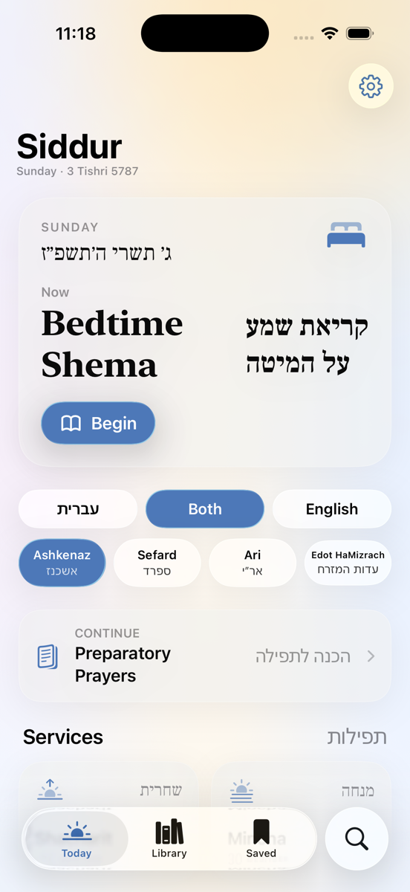
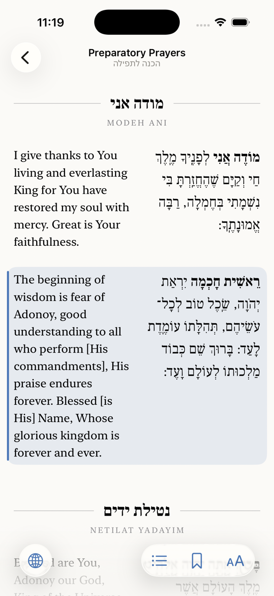
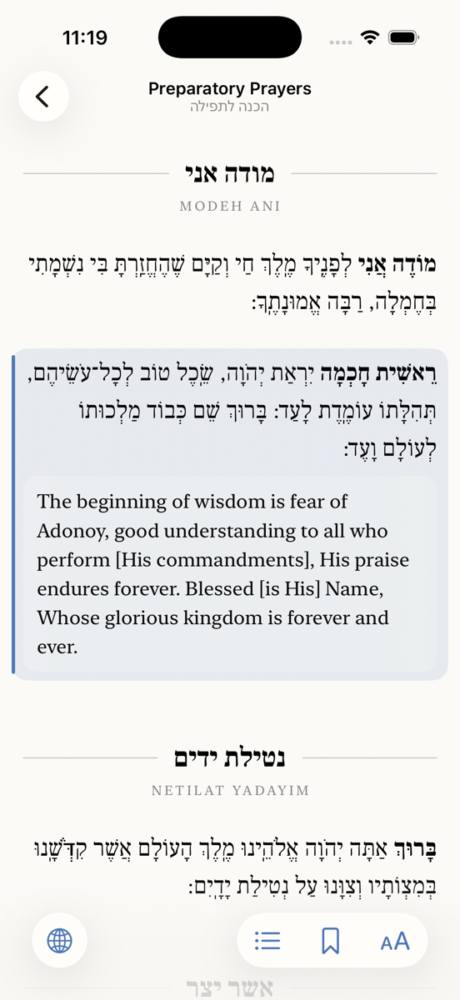

# Siddur

A native iOS 26 siddur with Liquid Glass UI. Hebrew on the right, English on the left, every paragraph paired with its translation. Text comes from [Sefaria](https://www.sefaria.org).

## Features

- **Four nusachim**: Ashkenaz, Sefard, Ari (Chabad, Hebrew only, weekday), Edot HaMizrach.
- **Synced translation**: each paragraph is one row, Hebrew right / English left, aligned at the top. Tap a paragraph to highlight it with its translation. In Hebrew-only mode a tap reveals the English beneath that paragraph (and vice versa). When type gets large on a phone the pair stacks automatically (Hebrew above English); this is the "Auto" layout, and side-by-side or stacked can be forced.
- **Language switch on the front screen**: עברית · Both · English. Also in the reader's bottom bar.
- **Typography**: pinch to zoom or use the slider; Hebrew faces Frank Ruhl (default), David, Noto Serif, SF Hebrew, Arial Hebrew, Times; English faces New York (default), San Francisco, Charter, Georgia, Palatino, Iowan, Baskerville, Hoefler, Avenir, Times. Line spacing, side-by-side or stacked bilingual layout, vowels and cantillation toggles, light/sepia/dark.
- **Traditional page**: bold opening words, small gray rubrics for instructions, Hebrew headings between hairlines with spaced small-cap English beneath, as in a printed Orthodox siddur.
- **Today**: Hebrew date, Shabbat / Rosh Chodesh awareness, and the service for the current time (optional location for real sunrise and sunset).
- **Fully offline from install**: every prayer of every nusach (844 prayers, about 10 MB of JSON) ships inside the app. No download, no connection needed, ever. Sefaria is only contacted if a ref is somehow missing from the bundle.
- Bookmarks, continue reading, search by English or Hebrew title.

## Screenshots

Captured on the iPhone 17 Pro simulator, iOS 26.5 (`docs/screenshots`). Also verified on iOS 27.0 with Xcode 27 RC on iPhone 18 Pro (`docs/screenshots/ios27-iphone18pro`) and iPad Pro 11-inch (`docs/screenshots/ios27-ipadpro11`): the Xcode 27 build has no code warnings, and none of the SwiftUI APIs used are deprecated in iOS 27.

| Today | Reader (paired) | Tap to reveal |
|---|---|---|
|  |  |  |

## Building

Requires Xcode 26 or 27 (iOS 26 SDK or later) for Liquid Glass APIs. Deployment target is iOS 26.0, so one build runs on both iOS 26 and iOS 27.

```sh
brew install xcodegen      # only if you edit project.yml
xcodegen generate          # regenerates Siddur.xcodeproj
open Siddur.xcodeproj
```

Select the Siddur scheme, pick an iPhone running iOS 26, and run. Set your team under Signing & Capabilities for a device build.

## Building and testing from the command line

```sh
export DEVELOPER_DIR=/Applications/Xcode.app/Contents/Developer
xcodebuild -project Siddur.xcodeproj -scheme Siddur -configuration Debug \
  -destination 'platform=iOS Simulator,name=iPhone 17 Pro' -derivedDataPath build CODE_SIGNING_ALLOWED=NO build
xcrun simctl boot "iPhone 17 Pro"; xcrun simctl install booted build/Build/Products/Debug-iphonesimulator/Siddur.app
xcrun simctl launch booted com.rowshr.siddur
```

### Screenshot walkthrough

`Siddur/Debug/SnapshotDriver.swift` (Debug builds only) walks every screen when the app is launched with `SIDDUR_SNAPSHOT_DIR` set. On iOS it writes `<name>.ready` markers into that directory and waits for `<name>.done`, so a shell loop can take the screenshots:

```sh
DIR="$(xcrun simctl get_app_container booted com.rowshr.siddur data)/tmp/snap"; mkdir -p "$DIR"
SIMCTL_CHILD_SIDDUR_SNAPSHOT_DIR="$DIR" xcrun simctl launch --terminate-running-process booted com.rowshr.siddur
while [ ! -e "$DIR/ALL-DONE" ]; do
  for r in "$DIR"/*.ready; do n=$(basename "$r" .ready); [ -e "$DIR/$n.done" ] && continue
    sleep 0.4; xcrun simctl io booted screenshot "shots/$n.png"; touch "$DIR/$n.done"; done; sleep 0.3
done
```

On macOS the same driver captures its own window directly, which is how the app was first exercised before Xcode was installed:

```sh
# build a throwaway macOS bundle (see project.yml for the iOS build)
mkdir -p /tmp/Siddur.app/Contents/{MacOS,Resources}
cp Siddur/Resources/Indices/*.json Siddur/Resources/Fonts/*.ttf /tmp/Siddur.app/Contents/Resources/
xcrun swiftc -O -parse-as-library -target arm64-apple-macos26.0 -swift-version 6 \
  -sdk "$(xcrun --show-sdk-path)" -module-name Siddur \
  -o /tmp/Siddur.app/Contents/MacOS/Siddur $(find Siddur -name '*.swift')
# Info.plist needs CFBundleExecutable=Siddur, NSPrincipalClass=NSApplication, ATSApplicationFontsPath=.
SIDDUR_SNAPSHOT_DIR=/tmp/shots /tmp/Siddur.app/Contents/MacOS/Siddur
```

## Layout

```
Siddur/
  App/         SiddurApp, RootView (tabs: Today, Library, Saved, Search)
  Models/      Nusach, SiddurNode (TOC), PrayerText, ServiceSlot
  Services/    SefariaClient (v3 texts API), TextRepository (memory+disk cache),
               SiddurLibrary (bundled TOCs), JewishClock (Hebrew date, sunrise/sunset), LocationService
  Settings/    ReadingSettings, FontCatalog, UserLibrary (bookmarks)
  Text/        HTMLText (Sefaria HTML -> styled runs), HebrewText (nikud stripping)
  Views/       Home, Browse, Reader, Settings, Components (Backdrop, glass pickers, Brand)
  Debug/       SnapshotDriver (Debug-only screenshot walkthrough, iOS and macOS)
  Resources/   Indices/*.json (compact Sefaria TOCs), Fonts/ (OFL), Assets.xcassets
```

## Data

Tables of contents are compacted from Sefaria's index API and bundled (`Resources/Indices`). Prayer text is bundled too (`Resources/Texts/<nusach>-texts.json`), produced by:

```sh
node Tools/fetch-texts.js            # all four nusachim
node Tools/fetch-texts.js ashkenaz   # one of them
```

The script pulls `https://www.sefaria.org/api/v3/texts/{ref}?version=hebrew&version=english` for every leaf and writes the same shape the app decodes. Re-run it to pick up corrections from Sefaria. At runtime `BundledTexts` serves the bundle first; `TextRepository` falls back to a disk cache and then to the API only for refs the bundle lacks. Launching a Debug build with `SIDDUR_OFFLINE=1` simulates no connectivity.

Coverage note: Sefaria's English is incomplete. Of the 844 prayers, 435 have Hebrew only (195 in Ashkenaz, 118 in Sefard, 81 in Edot HaMizrach, all 47 in Ari); those read as Hebrew regardless of the language setting.

Hebrew: The Metsudah Siddur (1981). English: translation based on the Metsudah linear siddur by Avrohom Davis. Chabad text: Wikisource (Hebrew only). Fonts: Frank Ruhl Libre, David Libre, Noto Serif Hebrew under the SIL Open Font License (see `Resources/Fonts/OFL-*.txt`).
